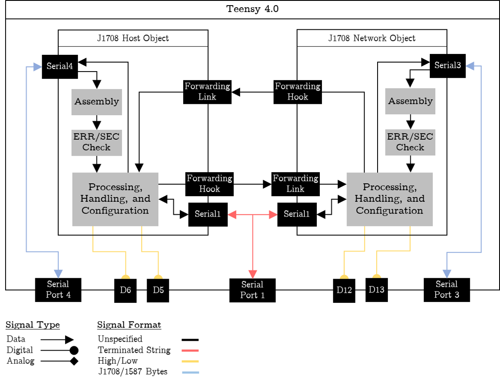
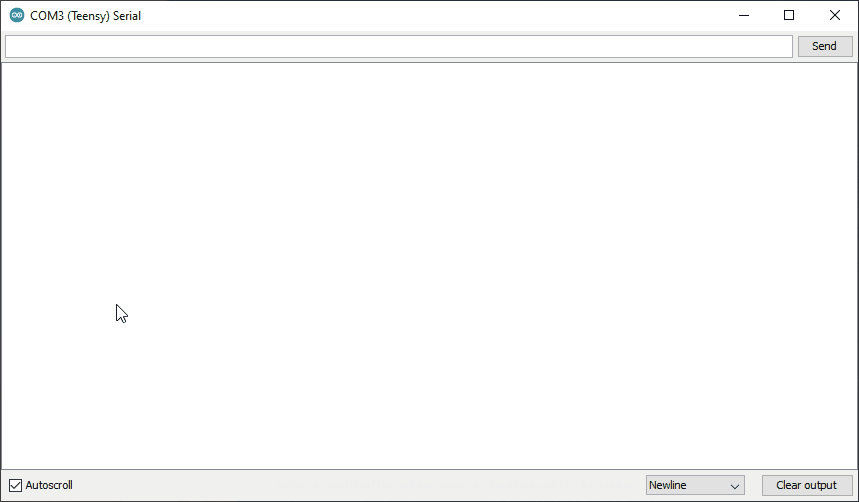
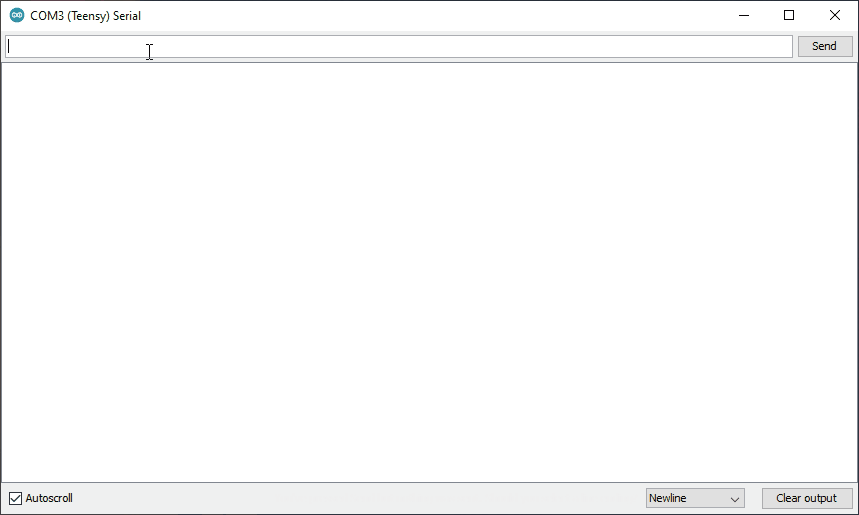
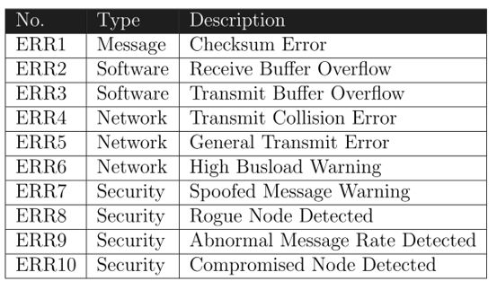
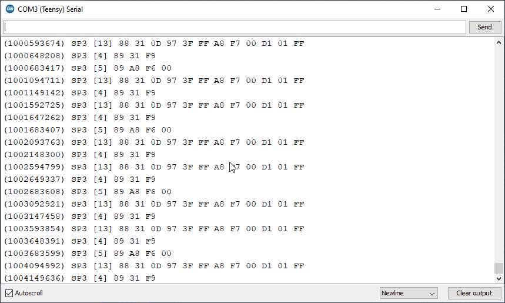

# Overview
**J1708_T4** is a gateway utility library that is compatible with the [Teensy 4.x](https://www.pjrc.com/store/teensy40.html). It provides basic tools for displaying, measuring, and sending traffic on an SAE J1708 bus. This code was written as part of my [Master's Thesis](#References) on securing legacy HD networks.

# Manual Installation
To install the library manually, you'll need to download it as a .zip file, extract it and put in the proper Arduino user library directory. The .zip file contains all you need, including a few examples on how to use it. If the library is installed properly, you should be able to see these examples in `File>Examples>J1708_T4`. 

You can also refer to articles within Arduino forums on custom library installation if you are unfamiliar with the process.

# Hardware
You'll need to incorporate a standard J1708 circuit with the Teensy 4.x to receive or transmit any messages to the serial bus. Here's a list of the minimum parts you'll need for one port. 

- (1x) Hex Inverter (NOT Gate)
- (1x) RS485 transceiver
- (2x) 4.7k ohm resistors
- (2x) 47 ohm resistors
- (Optional) LEDs

You can refer to the official standard or my own circuit implementation for inspiration.

# Design
The entire library revolves around a `J1708` object that is intended to represent a single port connection to the bus. This object is logically bound to a Teensy serial port on the of the users choice. All example use ports 3 and 4 by default to help avoid conflicts. 

One object is enough for interacting with the bus. Two objects can be linked together to create a simple network passthrough. The example script, `simplePass.ino`, should provide enough information to get acquainted with instantiating an object and linking multiple objects. The following component diagram provides the exact architecture of the example script. 

<p align="center"></p>

# Serial API Usage
## Runtime Configuration
### Help
The `j1708config` command is useful for adjusting the display and the device port settings during runtime. You can bring up the help page with the following command to see the available options.

```
j1708config <port> -h
```

<p align="center"></p>

### Display Settings
For example, to adjust the display settings back to default use the following command.

```
j1708config <port> -s -d
```

<p align="center"></p>

### Network Statistics and Errors
Basic messaging statistics are tracked by any instatiated port automatically. To view them, enter the following command:

```
j1708config <port> -s -s
```

Typical network and messaging errors are also tracked. Below is table for reference.

<p align="center"></p>

## Sending J1708 Messages
`j1708send` is useful for sending traffic to the network using a specific port during run-time. Use the `-h` option for more information.

### Standard Message
To send a simple 4-byte message on port three, use the following command:

```
j1708send sp3 4 de.ed.be.ef
```

<p align="center"></p>

### Transport Protocol
SAE J1587 provides rules for transporting payloads greater than 19-bytes. Every `J1708` object has built-in processing and handling procedures for RTS, CTS, CDP, EOM, and Abort messages. This will only work when port processing is turned on. To send a large payload used the `-T` option of `j1708send`.

For example, to send a simple 30-byte message on port three, use the following command:

```
j1708send sp3 -T 30 de.ed.be.ef.de.ed.be.ef.de.ed.be.ef.de.ed.be.ef.de.ed.be.ef.de.ed.be.ef.de.ed.be.ef.de.ad
```

## Control via Python
If the Teensy is plugged-in via USB, you can use the `pyserial` library to send commands to your device instead of the Arduino serial monitor. Here's an example script to get started.

```
import serial
myTeensy = serial.Serial('COM7',115200)
myTeensy.write(b'j1708send sp3 4 de.ed.be.ef\r\n')
myTeensy.close()
```

# References
[SAE J1708 - Official Standard](https://www.sae.org/standards/content/j1708_201609/)

[SAE J1587 - Official Standard](https://www.sae.org/standards/content/j1587_201301)

[MS Thesis] - (Currently embargoed. To be published 8/22/23)

# Limitations 
I'm a mechanical engineer doing programmer things. After writing this, I learned *how to* and *how to not* do stuff in C/C++. Bear in mind, even though my code has been unit tested, reviewed, and deployed on actual vehicle hardware, my code would certainly benefit from many more improvements. If you are interested in contributing, feel free to start an issue or reach out to me anytime!


> ⚠️ **TL;DR** Be warned - the performance of this library is limited.
